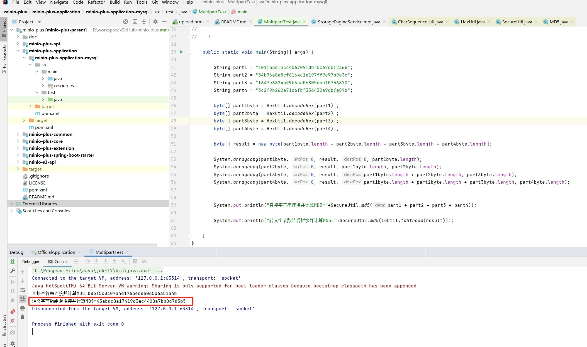

# MinIO Shard ETAG Generation Mechanism

In MinIO, consistency checks differ between shard uploads and regular uploads. Let's discuss them separately.

## Regular Upload
MinIO automatically generates an Etag label for all uploaded files, with the default algorithm being MD5. 
For consistency checks, the front-end program reads the local file to perform an MD5 calculation. 
After the upload is complete, comparing the two values ensures consistency.

## Shard Upload
MinIO calculates an MD5 for each shard, with each shard having its own hidden ETAG label, viewable only through the API, not the backend management page. 
After all shards are uploaded, when the file merge interface is called to merge them, MinIO concatenates the ETAG labels of all shards into a byte[] array and computes the MD5 value of this array as the ETAG of the entire file. 
It does not re-read the entire file stream for this calculation. This ETAG can be seen in MinIO's backend management interface.

You can upload the same file to MinIO using regular upload first and then shard upload. 
Although the file is the same, their ETAG values will be different.

Additionally, MinIO creates sparse files on the disk in advance during shard upload. 
Merging shards does not involve actual disk IO read/write, making it a safe operation. 
To ensure performance in minio-plus, we only compare the MD5 calculation results of the shards, i.e., the ETAG values of the shards, to ensure the overall consistency of the file.

## Example
Let's upload an 18.9MB file, sharded into 4 parts with each part being 5MB, as shown below:


The file's `ETAG` is `43abdc8a17419c3ac4400a7bb0d7d3b5-4`.
This `ETAG` has two parts: the MD5 value and the shard count.

Now, let's simulate MinIO's `ETAG` calculation process using the shard `ETAG` values to compute the entire file's `ETAG`.

```java
        String part1 = "101faaef4cc4567091dbf5c62d0f2a66";
        String part2 = "54b96a8a5cf6164c1e197ff9e97b9e3c";
        String part3 = "f647e6824a99b6ca06805dbc10756870";
        String part4 = "3c2f9b262e71c6fbf336432e9dbfe89b";

        byte[] part1byte = HexUtil.decodeHex(part1) ;
        byte[] part2byte = HexUtil.decodeHex(part2) ;
        byte[] part3byte = HexUtil.decodeHex(part3) ;
        byte[] part4byte = HexUtil.decodeHex(part4) ;

        byte[] result = new byte[part1byte.length + part2byte.length + part3byte.length + part4byte.length];

        System.arraycopy(part1byte, 0, result, 0, part1byte.length);
        System.arraycopy(part2byte, 0, result, part1byte.length, part2byte.length);
        System.arraycopy(part3byte, 0, result, part1byte.length + part2byte.length, part3byte.length);
        System.arraycopy(part4byte, 0, result, part1byte.length + part2byte.length + part3byte.length, part4byte.length);


        System.out.println("直接字符串连接并计算MD5="+SecureUtil.md5(part1 + part2 + part3 + part4));

        System.out.println("转义字节数组后拼接并计算MD5="+SecureUtil.md5(IoUtil.toStream(result)));
```

Run screenshot:



As seen here, direct string concatenation does not work, and the computed ETAG value does not match MinIO's. 
However, converting to byte arrays, concatenating, and then computing the MD5 value does produce a matching ETAG.