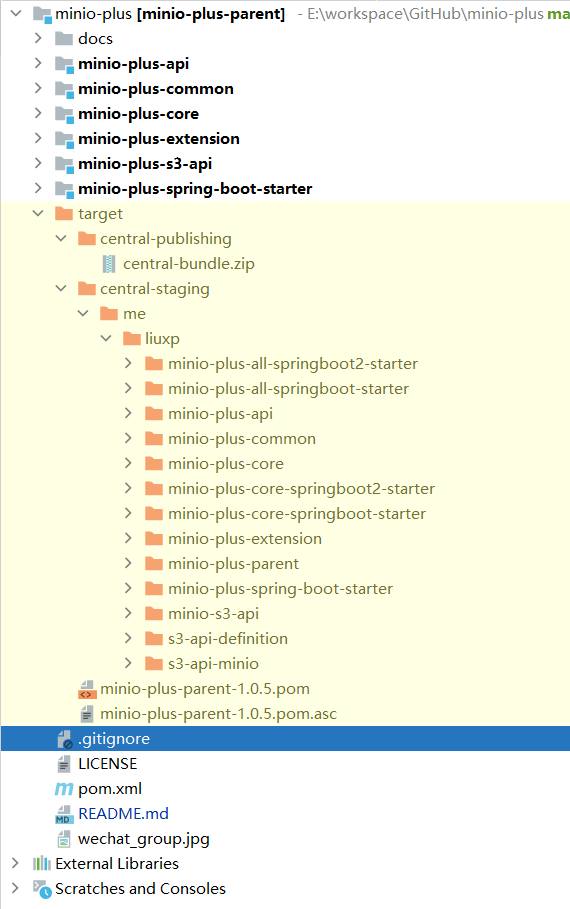

# MinIO-Plus 构建文档

本文档详细介绍如何构建 MinIO-Plus 项目，包括源码下载、编译打包和相关注意事项。

## 环境要求

在开始构建之前，请确保您的开发环境满足以下要求：

- **Java**: JDK 8 或更高版本
- **Maven**: 3.6.0 或更高版本
- **Git**: 用于代码版本控制
- **操作系统**: Windows、Linux 或 macOS

### 验证环境

```bash
# 检查 Java 版本
java -version

# 检查 Maven 版本
mvn -version

# 检查 Git 版本
git --version
```

## 下载代码

### 方式一：Git 克隆（推荐）

#### 1. 克隆主仓库

```bash
# 克隆项目到本地
git clone https://gitee.com/lxp135/minio-plus.git

# 进入项目目录
cd minio-plus

# 查看项目信息
ls -la
```

#### 2. 选择分支

```bash
# 查看所有分支
git branch -a

# 查看远程分支
git branch -r

# 切换到指定分支（如果需要）
git checkout develop
# 或切换到特定版本标签
git checkout v1.0.0
```

#### 3. 更新代码

```bash
# 拉取最新代码
git pull origin main

# 查看提交历史
git log --oneline -10

# 查看当前状态
git status
```

### 方式二：下载源码包

#### 1. 从 GitHub Releases 下载

1. 访问 [GitHub Releases 页面](https://gitee.com/lxp135/minio-plus/releases)
2. 选择最新稳定版本
3. 下载 `Source code (zip)` 或 `Source code (tar.gz)`

#### 2. 解压源码包

```bash
# 解压 ZIP 文件
unzip minio-plus-v1.0.x.zip
cd minio-plus-v1.0.x

# 或解压 TAR.GZ 文件
tar -xzf minio-plus-v1.0.x.tar.gz
cd minio-plus-v1.0.x
```

### 方式三：Fork 仓库（开发者）

如果您计划贡献代码，建议先 Fork 仓库：

```bash
# Fork 后克隆您的仓库
git clone https://gitee.com/YOUR_USERNAME/minio-plus.git
cd minio-plus

# 添加上游仓库
git remote add upstream https://gitee.com/lxp135/minio-plus.git

# 验证远程仓库
git remote -v

# 同步上游更新
git fetch upstream
git checkout main
git merge upstream/main
```

### 验证下载

下载完成后，验证项目结构：

```bash
# 查看项目结构
tree -L 2
# 或使用 ls
ls -la

# 应该看到以下主要目录：
# ├── docs/                           # 文档目录
# ├── minio-plus-api/                 # API 模块
# ├── minio-plus-common/              # 公共模块
# ├── minio-plus-core/                # 核心模块
# ├── minio-plus-extension/           # 扩展模块
# ├── minio-plus-s3-api/              # S3 API 模块
# ├── minio-plus-spring-boot-starter/ # Spring Boot Starter
# ├── pom.xml                         # Maven 主配置文件
# ├── README.md                       # 项目说明
# └── LICENSE                         # 许可证文件
```

## 编译打包

### 1. 基础编译

```bash
# 清理之前的构建产物
mvn clean

# 编译项目
mvn compile

# 清理并编译
mvn clean compile
```

### 2. 打包构建

#### 标准打包

```bash
# 打包
mvn package

# 清理并打包
mvn clean package

```

#### 指定模块打包

```bash
# 只构建核心模块
mvn clean package -pl minio-plus-core -am

# 构建多个指定模块
mvn clean package -pl minio-plus-core,minio-plus-api -am

# 构建 Spring Boot Starter
mvn clean package -pl minio-plus-spring-boot-starter/minio-plus-all-springboot-starter -am
```

#### 生成可执行 JAR

```bash
# 如果项目包含 Spring Boot 应用
cd minio-plus-spring-boot-starter/minio-plus-all-springboot-starter
mvn clean package spring-boot:repackage

# 验证生成的 JAR
ls -la target/*.jar
```

### 4. 安装到本地仓库

```bash
# 安装到本地 Maven 仓库
mvn install

# 清理并安装
mvn clean install
```

### 5. 部署到远程仓库

```bash
# 部署到远程仓库（需要配置）
mvn deploy
```

### 6. 生成文档

#### JavaDoc 文档

```bash
# 生成 JavaDoc
mvn javadoc:javadoc

# 生成聚合 JavaDoc
mvn javadoc:aggregate

# 查看生成的文档
open /minio-plus/minio-plus-core/target/apidocs/index.html
```

### 7. 构建验证



## 注意事项

### 1. Java 版本兼容性

#### JDK 版本要求

- **最低要求**: JDK 8
- **推荐版本**: JDK 8 或 JDK 11
- **测试版本**: JDK 17+

### 2. Maven 配置注意事项

为了加速依赖下载，可以配置国内镜像：

```xml
<settings>
  <mirrors>
    <mirror>
      <id>aliyun-maven</id>
      <name>Aliyun Maven Repository</name>
      <url>https://maven.aliyun.com/repository/public</url>
      <mirrorOf>central</mirrorOf>
    </mirror>
  </mirrors>
</settings>
```

### 3. 依赖管理注意事项

```bash
# 查看依赖树
mvn dependency:tree

# 分析依赖冲突
mvn dependency:analyze

# 解决依赖冲突
mvn dependency:resolve-sources
```

### 4. pgp加密问题

在构建过程中，特别是发布到 Maven 中央仓库时，可能会遇到 PGP（Pretty Good Privacy）签名相关的问题, 常见的 PGP 相关错误：

```
[ERROR] Failed to execute goal org.apache.maven.plugins:maven-gpg-plugin:1.6:sign
[ERROR] gpg: signing failed: Inappropriate ioctl for device
[ERROR] gpg: signing failed: No such file or directory
[ERROR] gpg: can't connect to the agent: IPC connect call failed
```

对于日常开发和测试，可以跳过 GPG 签名：

```bash
# 构建时跳过 GPG 签名
mvn clean package -Dgpg.skip=true

# 安装到本地仓库时跳过签名
mvn clean install -Dgpg.skip=true
```

在 `pom.xml` 中配置默认跳过，或者直接删除 gpg 插件：

```xml
<plugin>
  <groupId>org.apache.maven.plugins</groupId>
  <artifactId>maven-gpg-plugin</artifactId>
  <version>3.0.1</version>
  <configuration>
    <skip>true</skip>
  </configuration>
</plugin>
```

或使用 Profile 控制：

```xml
<profiles>
  <profile>
    <id>release</id>
    <build>
      <plugins>
        <plugin>
          <groupId>org.apache.maven.plugins</groupId>
          <artifactId>maven-gpg-plugin</artifactId>
          <version>3.0.1</version>
          <executions>
            <execution>
              <id>sign-artifacts</id>
              <phase>verify</phase>
              <goals>
                <goal>sign</goal>
              </goals>
            </execution>
          </executions>
        </plugin>
      </plugins>
    </build>
  </profile>
</profiles>
```

通过以上配置和解决方案，可以有效解决构建过程中遇到的 PGP 加密问题，确保项目能够顺利构建和发布。

> 💡 **构建提示**：
> - 首次构建可能需要较长时间下载依赖，建议使用国内镜像加速
> - 建议在构建前先运行 `mvn dependency:resolve` 预下载依赖
> - 使用 `mvn clean` 清理之前的构建产物，避免缓存问题
> - 生产环境构建建议使用固定版本的依赖，避免使用 SNAPSHOT 版本