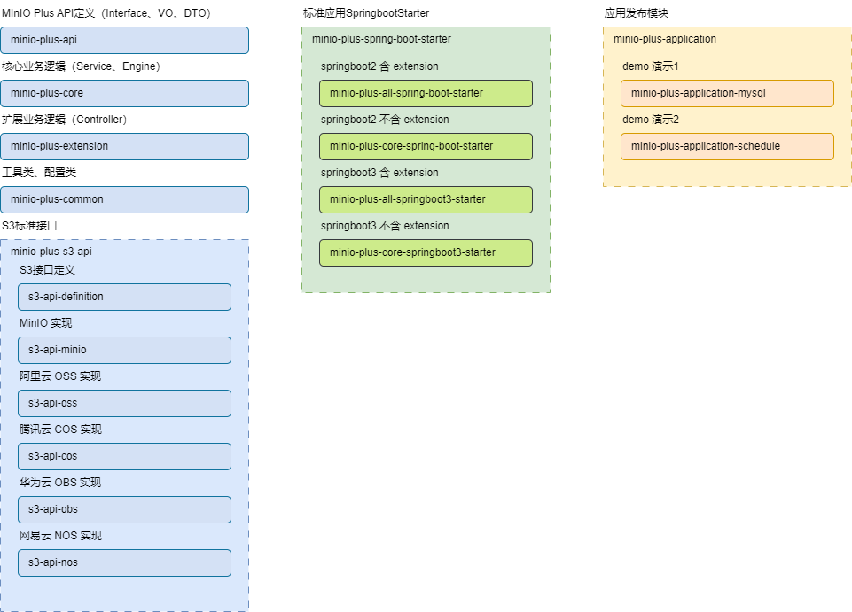

# 代码结构

项目定位为一个MinIO的Java语言SDK，非独立部署服务，并支持spring-boot自动装配。
用户自行实现数据存储部分，项目仅提供MySQL默认实现。

## 模块划分

* minio-plus-api：MinIO Plus 对外提供的能力接口定义，可以理解为 Service 层接口定义
* minio-plus-core：核心业务逻辑包，可以理解为 minio-plus-api 包的接口实现
* minio-plus-extension：扩展包，该包封装了Controller相关接口，可以理解为 minio-plus-api 包的接口的 Controller
  层封装，帮助项目使用时开箱即用
* minio-plus-common：工具类、配置类包
* minio-s3-api
    * minio-s3-api-definition：MinIO Plus 使用的S3规范接口定义
    * minio-s3-api-official：原生SDK实现
    * minio-s3-api-custom：自主实现
* minio-plus-spring-boot-starter
    * minio-plus-all-spring-boot-starter：包含core、extension、common、api
    * minio-plus-core-spring-boot-starter：包含core、common、api
* minio-plus-application
    * minio-plus-application-official：使用原生MinIO SDK与元数据使用MySQL数据库的示例工程
    * minio-plus-application-custom：使用自主实现S3规范与数据使用MySQL数据库的示例工程

## 包的划分
