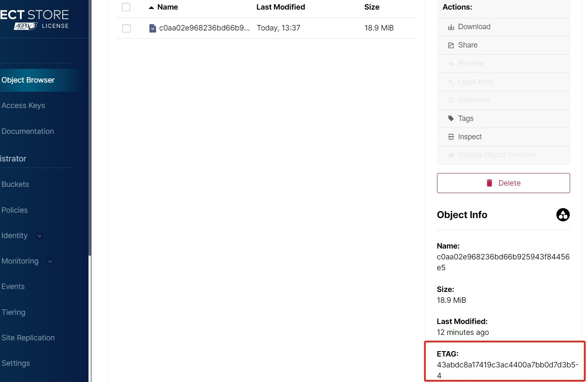

# MinIO 分片 ETAG 生成机制

在 MinIO 中，分片上传和普通上传时，文件一致性校验是不一样的，我们分开说。

## 普通上传
MinIO 会对所有上传的文件自动生成一个 Etag 标签，这个标签值的默认算法就是 MD5 。
所以我们在做一致性校验时，前端程序读取本地文件进行 MD5 计算，在上传完成时，比较两个值是否一致即可校验一致性。

## 分片上传
MinIO 会对每个分片进行 MD5 计算，每个分片有自己的 ETAG 标签，这个标签是隐藏的，只在 API 接口能查看，后台管理页面中是看不到的。
在所有分片上传完成后，我们调用文件合并接口进行合并时，MinIO 会将全部所有分片的 ETAG 标签进行 byte[] 连接，然后计算这个 byte[] 的 MD5 值做为整个文件的 ETAG，而不会再次读取整个文件流来进行计算，这个文件的 ETAG 是可以在MinIO的后台管理界面中看到的。
我们可以上传同一个文件到 MinIO 中，第一次使用普通上传、第二次分片上传，那么就会发现虽然是同一个文件，但是他们的 ETAG 值并不相同。

这里再提一个额外的知识，那就是 MinIO 在分片上传时会提前在磁盘创建出空洞文件（也可以叫稀疏文件），在合并文件时，并没有实际上的磁盘IO读写，所以合并分片是一个安全操作。
那么在minio-plus中，为了保证性能，我们仅对分片的 MD5 计算结果也就是分片的 ETAG 值进行一致性比较，即可保证文件的整体一致性。

## 举个例子
我现在上传一个18.9m的文件，按照5m进行分片，那么共计4个分片，如下图所示：


可以看到文件的`ETAG`是`43abdc8a17419c3ac4400a7bb0d7d3b5-4`
这个`ETAG`分成两部分，前面是MD5值，后面的分片数量。

那么现在我们模拟一下MinIO的`ETAG`计算过程，根据分片的`ETAG`计算整个文件的`ETAG`。
```java
        String part1 = "101faaef4cc4567091dbf5c62d0f2a66";
        String part2 = "54b96a8a5cf6164c1e197ff9e97b9e3c";
        String part3 = "f647e6824a99b6ca06805dbc10756870";
        String part4 = "3c2f9b262e71c6fbf336432e9dbfe89b";

        byte[] part1byte = HexUtil.decodeHex(part1) ;
        byte[] part2byte = HexUtil.decodeHex(part2) ;
        byte[] part3byte = HexUtil.decodeHex(part3) ;
        byte[] part4byte = HexUtil.decodeHex(part4) ;

        byte[] result = new byte[part1byte.length + part2byte.length + part3byte.length + part4byte.length];

        System.arraycopy(part1byte, 0, result, 0, part1byte.length);
        System.arraycopy(part2byte, 0, result, part1byte.length, part2byte.length);
        System.arraycopy(part3byte, 0, result, part1byte.length + part2byte.length, part3byte.length);
        System.arraycopy(part4byte, 0, result, part1byte.length + part2byte.length + part3byte.length, part4byte.length);


        System.out.println("直接字符串连接并计算MD5="+SecureUtil.md5(part1 + part2 + part3 + part4));

        System.out.println("转义字节数组后拼接并计算MD5="+SecureUtil.md5(IoUtil.toStream(result)));
```

运行截图：


这里可以看到，直接进行字符串拼接是不行的，计算出的ETAG值与MinIO并不一致。
而转换为字节数组后拼接，再计算，就一致了。